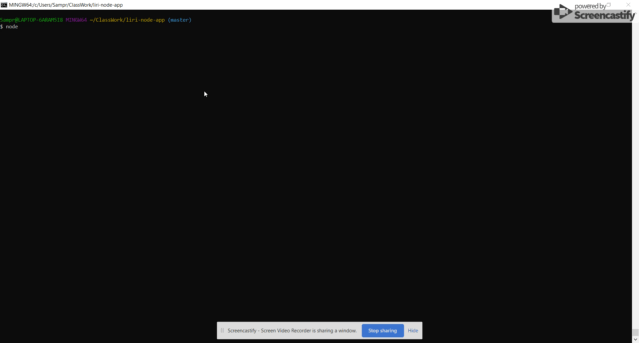
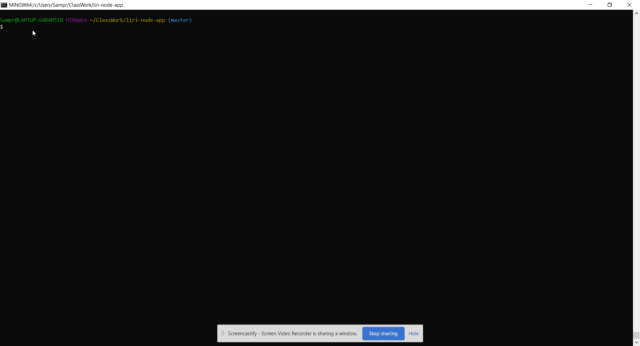

# LIRIBot
10-Homework-Node-LiriBot

LIRI is like iPhone's SIRI. However, while SIRI is a Speech Interpretation and Recognition Interface, LIRI is a _Language_ Interpretation and Recognition Interface. LIRI will be a command line node app that takes in parameters and gives you back data.
LIRI will search Spotify for songs, Bands in Town for concerts, and OMDB for movies.

To retrieve the data that will power this app, you'll need to install the following Node packages.

   * [Node-Spotify-API](https://www.npmjs.com/package/node-spotify-api)

   * [Axios](https://www.npmjs.com/package/axios)

     * You'll use Axios to grab data from the [OMDB API](http://www.omdbapi.com) and the [Bands In Town API](http://www.artists.bandsintown.com/bandsintown-api)

   * [Moment](https://www.npmjs.com/package/moment)

   * [DotEnv](https://www.npmjs.com/package/dotenv)

To show the following output the following information in the terminal/bash window, run LIRI Bot in the terminal/bash window using the following commands:

**Command List:**

1.  **node liri.js spotify ''**

- Artists 
- Song Name
- Spotify Song Preview Link
- The Song's Ablum
- Default song if no song input: Real Big
- Default artist: Mannie Fresh

2. **node liri.js movie ''**

- Movie Title
- Year Released
- IMDB Rating
- Rotten Tomatoes Rating
- Country of Production
- Movie Language
- Movie Plot
- Actors & Actresses
- Default movie if no movie input: 'Who Am I?.'

3. **node liri.js do-what-it-says**

The fs Node package takes the text contents of random.txt and uses it to call one of the LIRI commands.

Currently random.txt contents contains spotify-this-song for "Call Me Maybe."

**Examples**

Copyright Patrick Shea
Georgia Tech Coding Boot Camp (C) 201.
All Rights Reserved.